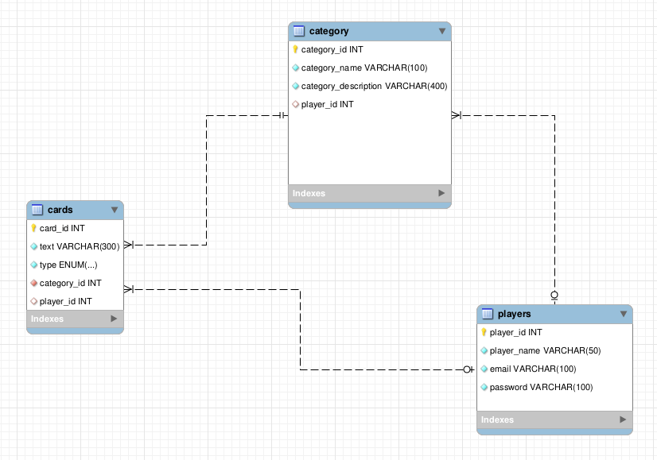

# Sin Vergüenza: Una App Móvil para Conectar y Divertirse

**Este juego te hará reír sin preocuparte por lo políticamente correcto, con un toque pícaro y atrevido.**

## 🃏 Descripción General
"Sin Vergüenza" es una aplicación móvil diseñada como herramienta para jugar e interactuar en grupo, fomentando la interacción personal fuera del entorno digital. El objetivo es pasar un buen rato con amigos mientras se compite en creatividad y originalidad.

## 🎲 Mecánica del Juego

**Determinación de Turnos Iniciales**:

- Cada jugador lanzará dos dados.
- Se sumará la tirada de los dados, y el orden de los turnos se  establecerá de mayor a menor puntuación.
- El jugador con la mayor puntuación será el primero en escoger una carta respuesta de entre las 5 posibles, el de menor por lo contrario, será el último.

**Turnos Posteriores**:

- A partir de la primera ronda, el ganador de cada partida será el primero en escoger carta y el turno continuará en el sentido de las agujas del reloj.

**¿Quién Gana Cada Partida?**:

- Se seleccionará al ganador mediante una votación en tiempo real entre los jugadores.
- La respuesta más original, según la mayoría, será declarada la ganadora.

## Dinámica del Juego
El juego está basado en preguntas y respuestas, inspirado en Cartas Contra la Humanidad, pero con una innovación: la incorporación de categorías temáticas.

**Selección de Opciones Iniciales**:

- Los jugadores determinan el número de participantes se aconseja un máximo de 8 jugadores por partida para que sea más dinámico y un mínimo de 3.
- Eligen la categoría de juego, que define el conjunto de preguntas y respuestas.

**Flujo de Juego**:

- La aplicación generará una carta pregunta y 5 respuestas y sumará una carta a partir del segundo jugador. Ejemplo: Si somos 4 jugadores cuando pidamos cartas de una categoria a la api el endpoint nos proporcionará una carta pregunta y 5 cartas respuesta iniciales más 3 (8 cartas respuesta).

- El jugador que está en turno revisa las respuestas disponibles y selecciona una.
- La respuesta elegida se registra (apuntada en papel).
- Este proceso continúa hasta que todos los jugadores hayan hecho sus elecciones.

**Sistema de Votación y Ganador**:

Una vez seleccionadas todas las respuestas, los jugadores votan presencialmente por la respuesta más original.
La votación define al ganador de la partida, quien inicia el próximo turno en el siguiente ronda.

**Opciones Dinámicas**:

Los jugadores pueden refrescar las preguntas o respuestas en cualquier momento si desean generar nuevas opciones.

## 📊 Estructura de la Base de Datos

**Tablas y Estructuras**

1. PLAYERS: Almacena información de los jugadores.

    **Columnas**:
    - player_id (INT, Primary Key): Identificador único del jugador.
- player_name (VARCHAR(50)): Nombre del jugador.
- email (VARCHAR(100)): Correo electrónico del jugador.
- password (VARCHAR(100)): Contraseña en formato seguro. "HASH"

2. CATEGORY: Almacena las categorías disponibles para las cartas.

    **Columnas**:
    - category_id (INT, Primary Key): Identificador único de la categoría.
    - category_name (VARCHAR(100)): Nombre de la categoría.
    - category_description (VARCHAR(400)): Descripción de la categoría.
    - player_id (INT, Foreign Key): Relación con el jugador creador o responsable.

3. CARDS: Almacena las cartas que serán utilizadas en el juego, asociadas a las categorías.

    **Columnas**:
    - card_id (INT, Primary Key): Identificador único de la carta.
    - text (VARCHAR(300)): Texto de la carta (pregunta o respuesta).
    - type (ENUM): Define si la carta es de tipo "pregunta" o "respuesta".
    - category_id (INT, Foreign Key): Relación con la categoría correspondiente.
    - player_id (INT, Foreign Key): Relación con el jugador que creó la carta.

**Relaciones entre Tablas**

- players ↔ category: Un jugador puede estar relacionado con múltiples categorías mediante player_id, pero una categoría solo puede estar asociada a un jugador. (1 a N)

- category ↔ cards: Cada categoría puede tener múltiples cartas asociadas mediante category_id, pero una carta solo puede estar asociada a una categoría. (1 a N)

- players ↔ cards: Un jugador puede crear múltiples cartas, relacionado mediante player_id, pero cada carta está asociada a un solo jugador. (1 a N)

En este caso las tablas se unen con líneas discontinuas porque la relación entre las entidades no es estricta o siempre presente. Una de las entidades puede estar relacionada de forma opcional con la otra.

## 🛠️ Instalación y configuración 

## 📡 Endpoints de la API

## 🚧 Estado del Proyecto

**En desarrollo activo**: Falta por implementar la parte del  front-end para que sea un juego visual e interactivo para conseguir que la experiencia de usuario en la interfaz sea ópttima.

## Desarrolladora del Back-End
- **[Estefanía](https://github.com/gestefania2)**
